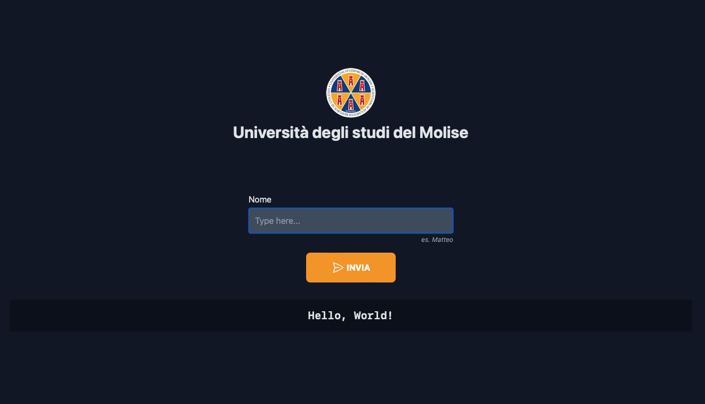

k8s-seminar web app
===



This is a very simple web app to showcase a deploy on k8s.

This app is composed by:

- a client rendered web UI (Angular)
- a web service exposing a REST api endpoint (Spring Boot)

The deployment files are hosted in a separate repo [mattmezza/k8s-seminar-config](https://github.com/mattmezza/k8s-seminar-config).


# How to run the web app locally

In order to run the web app locally, you will need to install the following on your machine:
- nodejs (for the UI)
- openjdk (for the api)

For further info on how to install the web app locally, please refer to the individual app (ui and api).

# How to build images

First, make sure you cloned this repository on your machine.

## UI

```
cd ui
docker build -t k8s-seminar-ui:1.0.0 .
```


## API
```
cd api
mvn package
docker build -t k8s-seminar-api:1.0.0 .
```

# How to run the containers

Once you have built the images, running the containers is pretty easy.

## UI

```
docker run -p8081:80 k8s-seminar-ui:1.0.0
```

## API
```
docker run -p8080:8080 k8s-seminar-api:1.0.0
```

A this point you should have the UI running on port `8081` and the API running on port `8080` on your local machine.

This means you can open your browser and visit [http://localhost:8081](http://localhost:8081).


# How to deploy

Instructions on how to deploy this web app on a k8s cluster can be found in [mattmezza/k8s-seminar-config](https://github.com/mattmezza/k8s-seminar-config).
